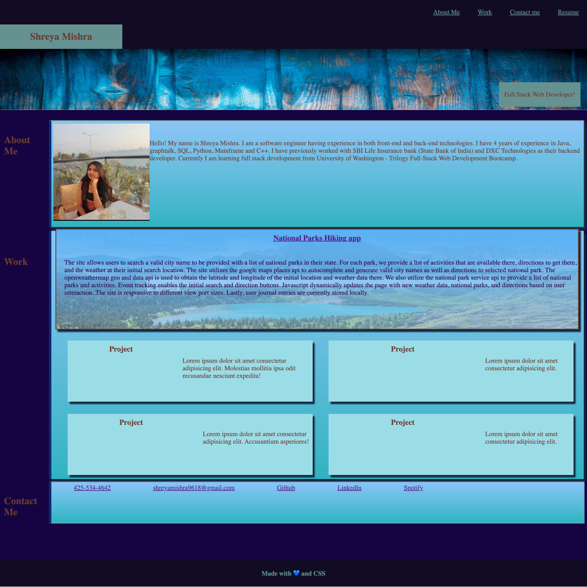

# Portfolio_Shreya_Mishra
This repository provides ditails of my work and education. 
GIT HUB URL:https://github.com/shreyamishra9618/Portfolio_Shreya_Mishra
### Website URL:https://shreyamishra9618.github.io/Portfolio_Shreya_Mishra/

### Description
This Website, acts as an introduction to my coding experience, a display of my coding portfolio, and listing of contact information. The webpage utilizes semantic HTML:5 and CSS to aesthetically generate a landing page with professional photo, a section describing me, a section for my portfolio, and a section for contact information. Flexbox and relative positioning were used to generate the layout. The page is responsive to different screen sizes.

### Installation
There is no installation required or capable with this repository. Running the index.html file in a default browser renders a static webpage that is identical to the one found at here.

### Usage
Select the links in the header navigation bar to move to main sections on the webpage. Select the photos for each portfolio item to get taken to the Github repository for each project.

